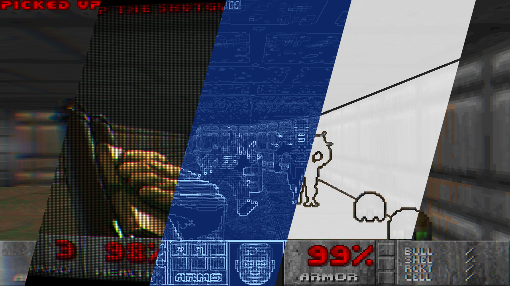
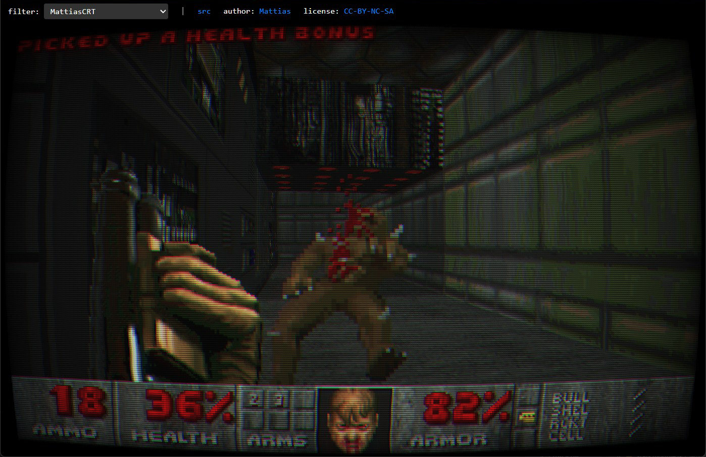
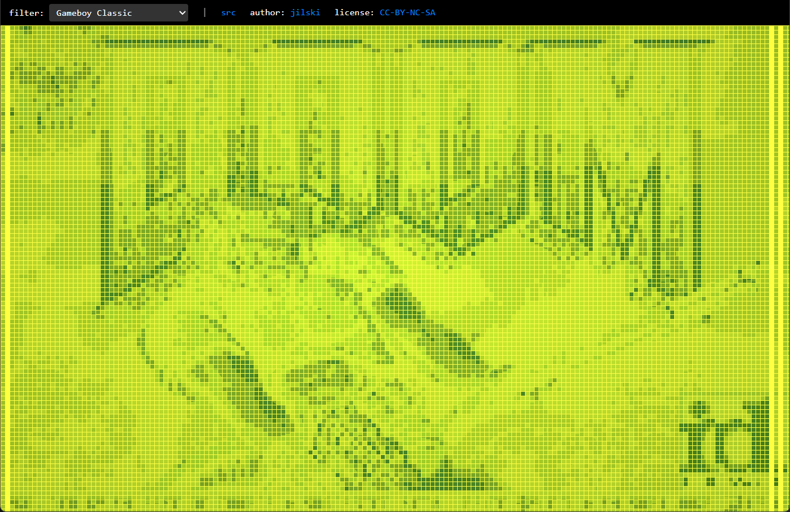
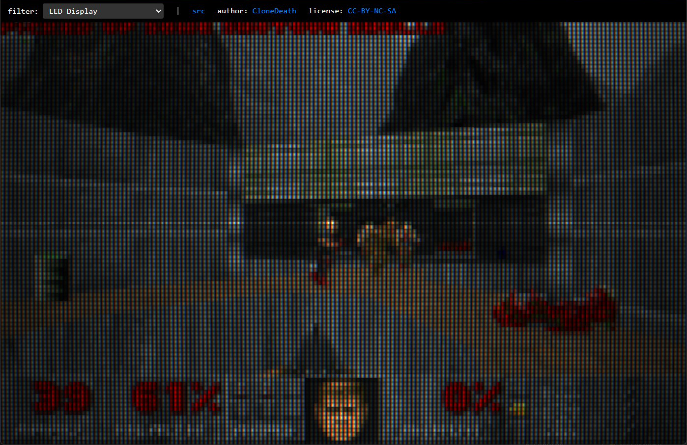
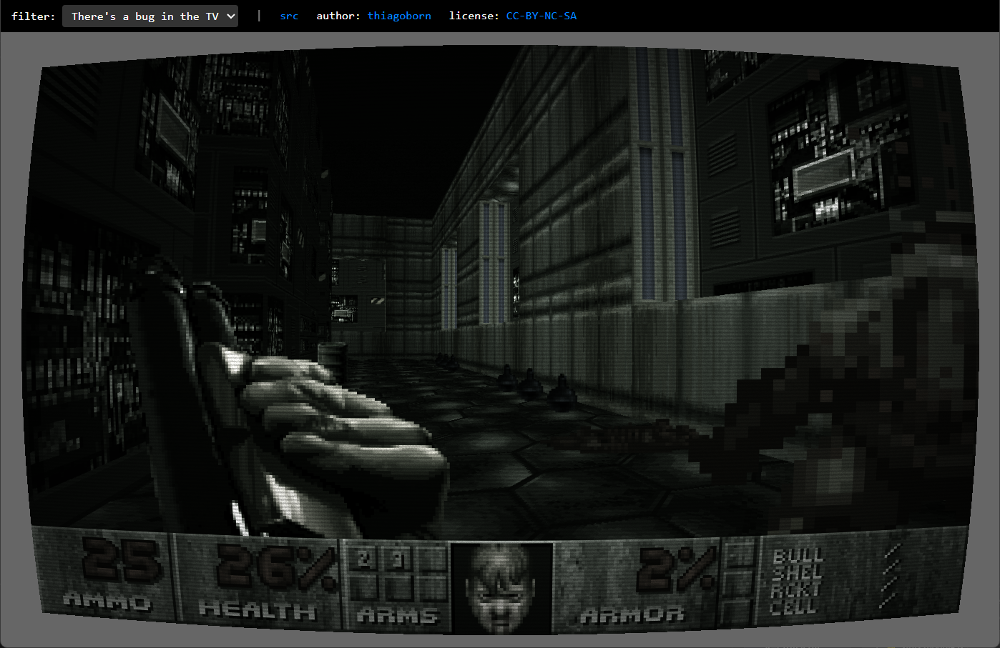
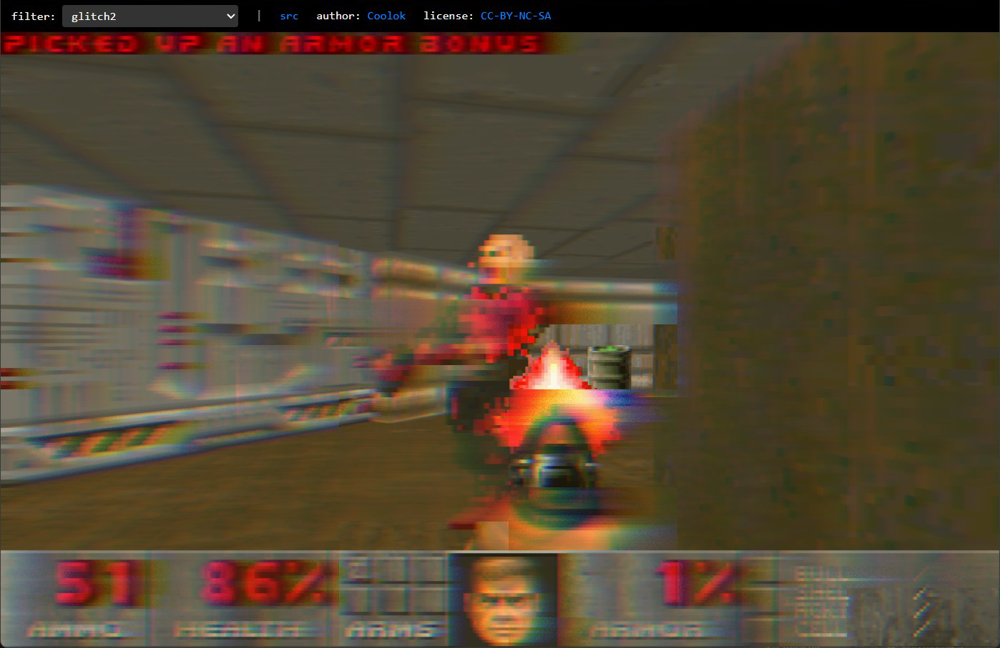
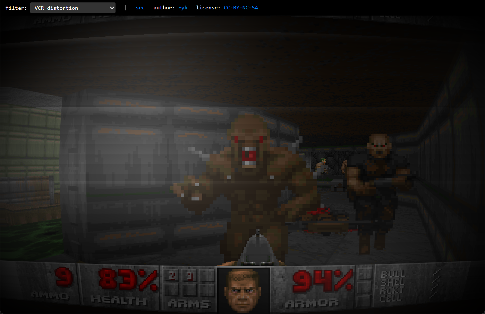
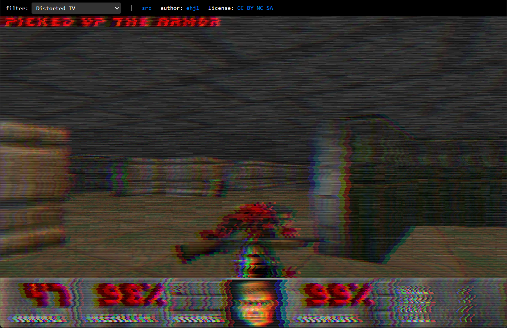
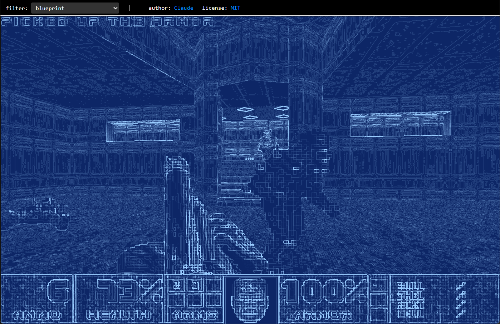
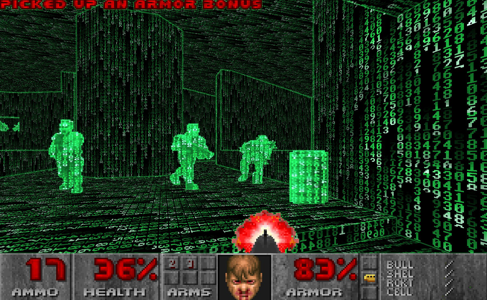

# WebGPU-DOOM

Ported by Claude

[WebGPU With Post Processing](https://greggman.github.io/WebGPU-DOOM/index-postprocess.html?pp=matrix)

[WebGPU Base Version](https://greggman.github.io/WebGPU-DOOM)

[WebGL2 With Post Processing](https://greggman.github.io/WebGPU-DOOM/index-postprocess-webgl2.html?pp=matrix)

[WebGL2 Base Version](https://greggman.github.io/WebGPU-DOOM/index-webgl2.html?pp=blueprint) [See below](#webgl2)

## Why?

I'm not sure this is true but in the age of AI code, lots of people
are questioning if we need libraries anymore. I'm not sure DOOM is
the best example to ask for that since it has it's own way of doing
things which is long before GPUs were common in PCs.

That said, you can ask the AI to make your app using some framework,
or you can ask your AI to make your app directly. There are tradeoffs.
Using a common framework might already have integrations for features
you want. On the other hand, the AI can often just make those features
for you. Conversely, using a framework might push your app into some
design that doesn't really fit your app. Asking the AI you can often
get it to make exactly what your app needs.

As one example, we can compare [three-doom](https://github.com/mrdoob/three-doom)
to this port.

* I'm guessing they took the same amount of prompting. It didn't 
  take that long to get DOOM running in WebGPU. Maybe 3 hours.
  It took longer to find a few bugs but almost none of those bugs were
  anywhere near the graphics code.

* Three.js is a generic 3d library which has almost zero relation to what is
  needed to port DOOM. As such, three-doom is 600k larger (minified), (150k
  larger gzipped). 2.4x larger than this port (289k vs 122k). It also appears
  to be 2x to 3x slower. (*) Maybe neither of those matter or maybe more
  iterations would  change that. A few hundred kilobytes more or even a 3x
  speed difference means nothing to DOOM in 2026 as the entire game only
  renders around 800 - 1600 triangles a frame. Compare to a modern AAA game
  that might draw 5 to 10 million triangles per frame. 4-5 orders of magnitude
  more. Further, the data itself, `DOOM1.WAD` is 4meg and so out shadows any
  JavaScript size.

  What that means is it doesn't matter that a framework is slower
  or larger for this specific port. That said, if you're making
  something more modern, or something targeting slower devices,
  a speed difference might matter a lot so it might pay off to
  ask your AI of choice to make a custom solution for your project.

You might think using a framework brings battle tested solutions.
That might be right. At the same time, Claude, and probably other AIs,
so far, go way beyond what I'd normally do to test. In most of my 3D
work I just edit and then run and see if it looks good. Claude though,
will easily write much more detailed and comprehensive tests.

As one example it found that keys for doors were ignored. It fixed the bug
and that's where I might have stopped if I was doing it myself.
But, Claude ran all the demo recordings to see if fixing it broke
any demo. Then it checked doors don't open without the key and they
do with. I might have checked that 2nd one by hand but in a past
life I'd have been unlikely to check the first and would have just
waited for bug reports.

That kind thing is common. Use a library, maybe get frustum culling.
But ask claude to add it and you get both frustum culling and
comprehensive tests that it works. The point being again, maybe
reaching for a library is not as compelling as it used to be in this
new AI world. You can see another example in [sedon](https://github.com/greggman/sedon).
That project also didn't use a library. I just asked for each needed
feature (rayleigh scattering, bloom, frustum based grass, dynamically
lodded terrain, etc...) and the AI just made it.

## Prompting Details

Mostly I just made a folder with the source to DOOM in a sub-folder.
I asked Claude to convert it to TypeScript and WebGPU with no libraries
and use esbuild to build it.

## Interesting issues

1. Demo failed because of stubbed out stuff.

   It got up to running the demo but behavior wasn't the same.
   It spent quite a long time on this and when it finally found it
   it was stuff it had stubbed out earlier. I questioned why it hadn't
   added all the stubbed parts to some TODO list. It searched the code
   and made a list.

2. Built C version to compare for demo.

   When it couldn't figure out the demo sync issues it finally
   built the C version with no graphics and added a lot of logging
   so it could compare one to the other exactly.

3. Build C version to compare for audio

   It spent several hours trying to get the music correct. At one point it wrote
   out .WAV files and asked me to listen. Even though it got better, it was
   still not right. So I told it output the audio from the C version
   and compare. Even this did't fix it.

   This particular part took way too long. AFAICT it's still not
   perfect but it's good enough and we moved on. The issue is it's
   writing its own emulator for hardware that DOOM ran on. The code
   for that emulation is not in the DOOM code.

   I did suggest building DOSBox and running the C code in it and
   outputting the audio as that would provide working emu for the hardware.
   Claude thought that was a good idea but since it was working good enough
   we moved on.

4. Small things that were hacked by Claude

   * The Level Map

     Claude hacked together the level map. I don't know how it's
     implemented in DOOM but I'm guessing it just works by marking
     which segments are rendered since DOOM's software renderer
     works by never over-drawing, they know exactly what the user
     can see. This is as opposed to triangle renderers which often
     use z-buffers and which any results are still on the GPU.

     Claude added it but didn't take into account that you should not be able to
     see behind doors. It further didn't know that the map doesn't fill in while
     viewing it. I only bring this up because, assuming it was going from the
     original code, it seems like these things should be encoded in that code. I
     guess part of that is probably coming from the renderer which is not copied
     so maybe it makes sense. It's interesting that apparently Claude just
     imagined how it worked and made up it's own solutions. Or else maybe it
     looked at the original code but just enough to get an idea how to draw a
     map, not its specific behavior.

   * Intermission

     This is another example where we needed to finish the game and
     so I asked Claude to add in things. For some reason it made
     a black screen with small red text showing your score for the
     level.

     The real DOOM does a tally of your score over a world map
     in a large font with labels left justified and scores right
     justified. I have no idea why Claude thought the black screen
     was acceptable.

     Even after asking it to fix things it was a few more iterations
     to get everything correct. Kills was 0. Time was missing minutes.
     It then over corrected for PAR.

     I bring this up because, at least for now, a single step takes
     5-10 minutes so every step that Claude doesn't get correct adds
     up. You think you'll make this 5 minute request and 90 minutes
     goes by.

   * A Seam

     I don't know if I didn't notice but a day into this I saw a
     seam in the ceiling in the first level. This is a place where
     the triangles don't line up enough to entire cover the background.

     Claude chugged along trying all kinds of things, some of which made
     things worse. None of which fixed them. Plus, it couldn't see the
     seam itself. It even claimed to have written a renderer at one point
     but claimed no seams.

     Finally I told it to run the game in puppeteer and give me a readout for
     player position and angle so I could tell it exactly where to be. I also
     told it to clear to magenta and stop drawing the sky so the seam would be
     easy to spot. This took a few iterations as it claimed it couldn't use
     puppeteer with WebGPU. So I hand made an example. Once I got that working I
     pointed Claude at it and it was able to make a repo and work through the
     seam issue.

     From that point on it started using screenshots to check all kinds of
     things. That suggests it's good to get screenshots working ASAP.

## WebGL2

Why a WebGL2 version - Because WebGPU is still only around 70% coverage. But,
the important part to take away I think is, when the WebGPU version was finished
I asked Claude to port it to WebGL2. It was less than 15 minutes until it was
rendering the world and the sky. Another 15 minutes to separate the WebGPU parts
from main.ts into an API agnostic renderer.ts. A final 15 minutes to update the
WebGL side to be fully working. The point again being that AI can just do these
things we used to use a library for and/or which used to be a lot of work.

Interestingly, since we had already setup rendering via Puppeteer, it used
that to check things were working. Something it didn't do when building
the original.

## Post Processing

Again, ask and ye shall receive. I asked Claude to add post processing. I gave it a list of effects. 20 minutes later
I had examples of post processing. I pointed it at
[pico-8-post-processing](https://github.com/greggman/pico-8-post-processing), and told it to copy and adapt
some of the shaders, and keep the credits, and 15 minutes
later that was in too.

### Editing Shaders

You can click the "edit" button and edit any shader.
Click "Save & Copy URL" and it will give you a URL you can share.
Click the "?" icon for docs on the various inputs.

# [LICENSE](LICENSE.md)

## Footnotes:

(*) The comparisons above were at "initial commit" which was feature parity.
    Since then many new features have been added.

